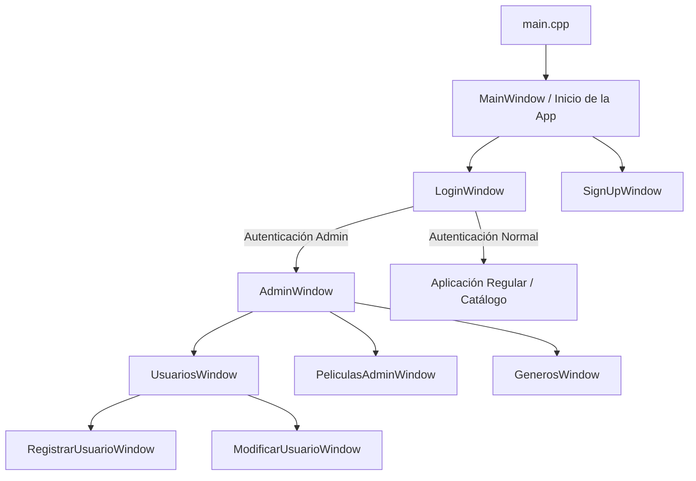

# Arquitectura

El proyecto está diseñado bajo un formato por capas implícitas, donde convergen el control de la interfaz gráfica, el esquema de negocio y una persistencia en base de datos.

## Descripción de las Capas

1. **Interfaz Gráfica:** 
   Implementada principalmente con el *framework* **Qt**. Las vistas son gestionadas por archivos de Qt Designer (`.ui`), encabezados correspondientes (`.h`), e implementación (`.cpp`). Estas clases gestionan todo lo visual, emitiendo y capturando eventos como clics.
   
2. **Clases del Dominio (Modelos):**
   Las clases que implementan la lógica base en Programación Orientada a Objetos: `Usuario`, y la familia de contenidos encapsulada con Herencia: base abstracta `Contenido`, junto a las derivadas `Pelicula` y `Serie`. A su vez, `Serie` se relaciona con `Temporada` y estas últimas con `Episodio`.

3. **Administración y Lógica del Sistema:**
   Parte de la lógica fluye en las mismas ventanas (por ejemplo `mainwindow`, `adminwindow`, etc.) comunicando lo visual con lo necesario según los requerimientos (ej: un usuario normal versus un administrador).

4. **Persistencia / CRUD / Base de Datos:**
   Soportada por la carpeta `crud/`. Utiliza SQLite (por medio de `sqlite_orm`) para insertar, localizar, actualizar, y eliminar registros locales de usuarios y otros datos vitales como el de películas sin depender de estructuras volátiles temporales (listas en RAM).

## Flujo General de Ejecución

1. **Punto de Entrada (`main.cpp`):**
   Inicializa la aplicación global de Qt (`QApplication`) y carga la ventana principal/inicial.
2. **Sistema de Ventanas (Login y Autenticación):**
   El código muestra interfaces de logueo (`loginwindow`), o registro (`signupwindow`).
3. **Navegación:**
   Si es usuario regular, será redirigido a las vistas de catálogo u operaciones habituales. Si el rol es el adecuado (Administrador), navegará al panel de administración (`adminwindow`), donde el sistema se ramifica al control de Películas, Usuarios, y Géneros.
4. **Almacenamiento y Recuperación:**
   Ante cualquier cambio o solitud, la ventana involucrada hace una llamada al `Repositorio` SQLite, guardando estado persistente o retornando registros.

## Diagrama de la Arquitectura de Interfaz

## Papel de las Clases del Dominio

- **`Contenido`**: Es la clase base abstracta (`virtual void mostrar() = 0;`) que provee los atributos generales (id, nombre, duración, calificación, género).
- **`Pelicula`**: Hereda de `Contenido`. Implementa la presentación de reproducciones unitarias.
- **`Serie`**: Hereda de `Contenido`. Introduce atributos para poder contener ciclos lógicos a través de un arreglo de objetos `Temporada`.
- **`Temporada`**: Encapsula y gestiona agrupaciones lógicas de secuencias a través de objetos de la clase `Episodio`.
- **`Episodio`**: Unidad audiovisual dependiente de un número y vinculada a una Temporada en específico.
- **`Usuario`**: Estructura general de consumidores de la plataforma, dotada de id, nombre, contraseña y permisos (Roles).